<p align="center">
  
</p>

[](https://skills.sh/tfboy1/oh-my-minimaxh3-director/oh-my-minimaxh3-director) [](https://www.ifdian.net/item/1a20ed042f0711f1865a52540025c377) [](https://www.creem.io/payment/prod_1yc40mIhKwwrc7iqFOG9G2) [](https://github.com/TFboy1/oh-my-minimaxh3-director/stargazers) [](LICENSE)

[](../README.md) [](README_EN.md) [](#) [](README_FR.md) [](README_DE.md)

<p align="center">
あなたの AI 映像監督。脚本を預けて、完成カットを受け取ろう——
ストーリーボード → MiniMax H3 生成 → 剪映ワンクリック編集の自動パイプライン。
</p>

## 特徴

- 🎬 **自動ストーリーボード**：脚本をセグメント（デフォルト各 10 秒、2〜3 カット）に分割し、
  `storyboard.md`・`storyboard.json`・H3 六部構成プロンプトを生成。
- 🎞️ **MiniMax H3 ワークフロー自動ルーティング**：参照画像があれば Ref2VA、テキストのみなら T2V、
  前後フレームがあれば I2V を選択。`class_type` 単位でパラメータを上書き（ノード ID 直書きなし）。
- ✅ **パラメータ確認**：提出前に全パラメータを表にまとめて確認。不正値（長さ 5-15 秒、ステップ 4-40 等）はバックエンドで拒否。
- ☁️ **Cloudflare トンネル**：ローカル 8188 / 既存トンネル / AutoDL を自動検出し、
  リモートアクセスが必要なときだけ TryCloudflare を起動・再利用。
- 📥 **バッチ提出＆レジューム監視**：参照画像をアップロード → 各セグメントを提出 →
  ポーリング・ダウンロード。自動リトライと状態永続化付き。
- ✂️ **剪映自動編集**：jianying-editor で剪映ドラフトを生成（クリップ順序 + ディゾルブ）、
  任意で MP4 自動書き出し。
- 🖥️ **初回オンボーディング**：自動更新の確認、ComfyUI の検出、ハードウェア評価、
  ModelScope からのモデル導入案内、補助スキルと MCP の導入を「用途を説明してから」順に確認。

## インストール

skills.sh から（推奨）：

```bash
npx skills add TFboy1/oh-my-minimaxh3-director --skill oh-my-minimaxh3-director
```

またはクローン：

```bash
git clone https://github.com/TFboy1/oh-my-minimaxh3-director.git
```

## 初回利用

初回起動時、各項目の用途を説明したうえで以下を確認します：

1. **自動更新**を有効にするか（推奨）；
2. **ComfyUI** はインストール済みか（未導入ならデスクトップ版ダウンロード手順を案内）；
3. **ハードウェア検出**で MiniMax H3 を実行できるかを評価；
4. **MiniMax H3 モデル**をダウンロード済みか（未導入なら ModelScope の手順を案内）；
5. 補助依存：`h3-prompt-writing`（プロンプト）、`jianying-editor`（編集）、`comfy-mcp`（ComfyUI 管理）。

詳しい手順：[references/setup-guide.md](../references/setup-guide.md)

## 使い方

Codex で以下のように指示します：

> $oh-my-minimaxh3-director を使ってこの脚本を動画にしてください

パイプライン：

```text
脚本 → ストーリーボード → H3 ワークフロー → パラメータ確認 → 生成
→ クリップ取得 → 剪映ドラフト →（任意）自動書き出し
```

手動実行：

```bash
python scripts/probe_comfy.py --workspace <作業ディレクトリ> --write
python scripts/ensure_cloudflared.py --workspace <作業ディレクトリ>
python scripts/build_workflows.py --project <プロジェクト> --workspace <作業ディレクトリ>
python scripts/submit_jobs.py --project <プロジェクト> --workspace <作業ディレクトリ>
python scripts/monitor_jobs.py --project <プロジェクト> --workspace <作業ディレクトリ>
python scripts/generate_assembly.py --project <プロジェクト> --title <タイトル>
```

## ハードウェア要件

`python scripts/check_hardware.py`（リモート GPU は `--remote-url <URL>`）で確認：

| VRAM | 判定 | 推奨 |
|---|---:|---|
| 12GB 未満 | ローカル非推奨 | クラウド GPU（AutoDL 24GB+）または Comfy Cloud |
| 12-16GB | 入門 | int8/nvfp4 量子化 + 4 ステップ Turbo、0.4MP 短尺 |
| 16-24GB | 推奨 | 0.4-0.6MP、10 秒 |
| 24GB+ | ハイエンド | 0.6-1MP、10-15 秒 |

モデル合計約 40GB。NVIDIA GPU + CUDA 必須、ディスク 60GB+ 推奨。

## クレジット

本スキルは以下のオープンソースプロジェクトの上に成り立っています：

- [MiniMax H3](https://github.com/MiniMax-AI/MiniMax-H3)（MiniMax-AI）：モデル本体と
  `h3-prompt-writing` スキル（MiniMax H3 コミュニティライセンス）；
- [ComfyUI](https://github.com/Comfy-Org/ComfyUI)：生成エンジン（GPL-3.0）；
- [jianying-editor-skill](https://github.com/luoluoluo22/jianying-editor-skill)
  （luoluoluo22）：剪映編集 JyWrapper（MIT）；
- [comfy-mcp](https://github.com/Comfy-Org/comfy-mcp)（Comfy-Org）：ComfyUI MCP
  サーバー（AGPL-3.0-or-later OR Commercial）；
- [cloudflared](https://github.com/cloudflare/cloudflared)（Cloudflare）：トンネル（Apache-2.0）。

一覧：[CONTRIBUTORS.md](../CONTRIBUTORS.md)

## ライセンス

スキルコードは **MIT** ライセンスで公開（[LICENSE](../LICENSE)）。
モデル重みは MiniMax H3 コミュニティライセンス、上流コンポーネントは各ライセンスに従います。
